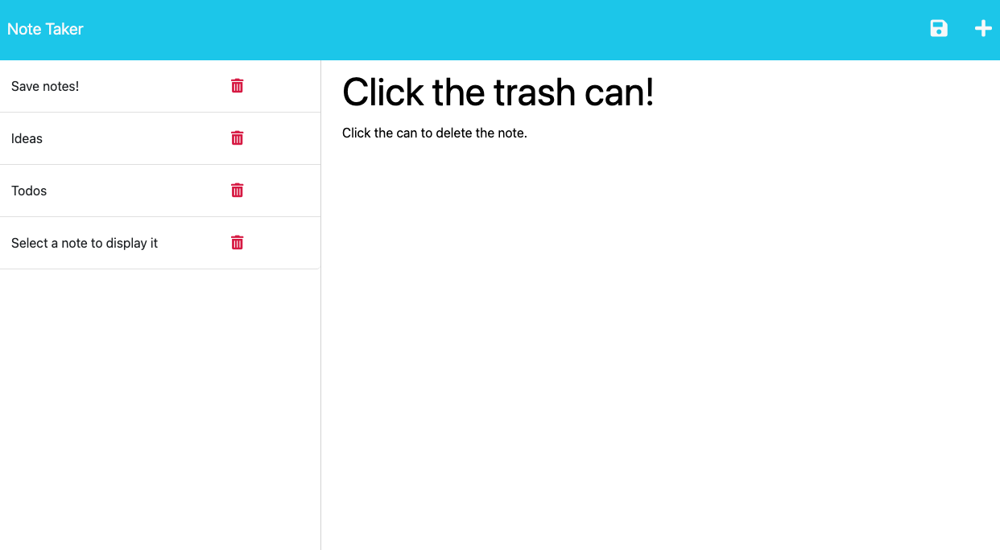

# Note Taker

## Description

Note Taker is an application that allows you to write, save, and delete notes. This application uses an Express.js back end and saves and retrieves note data from a JSON file. It's designed for individuals who need to keep track of tasks, organize thoughts, or write down ideas.

## Table of Contents

- [Deployment](#deployment)
- [Usage](#usage)
- [Mock-Up](#mock-up)
- [Questions](#questions)

## Deployment

This application is deployed on Heroku. You can access it using the following link: [Note Taker](https://note-taker-one-623da91cc8a0.herokuapp.com/)

## Usage

When you first open the Note Taker application, you are presented with a landing page with a link to the notes page. After clicking the link, you are redirected to a page where existing notes are listed and empty fields are shown for a new note.

After you enter a new note title and text, a save button will appear at the top of the page. Clicking it will save the note which will then appear in the column with other saved notes.

Clicking on an existing note will display that note's content. If you want to enter a new note, simply click on the (+) icon at the top of the page and new empty fields will appear.

## Mock-Up

The following images show the web application's appearance: 

## Questions

Have questions? Contact me through GitHub here: https://github.com/Lone1ne
